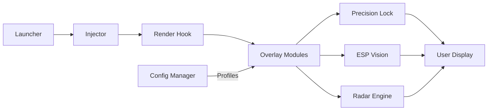

# CloverPit Trainer 🎯

The **CloverPit Trainer** is a next-generation **game enhancement toolkit** built for precision players. Designed for Windows users, it combines intelligent **aim stabilization**, dynamic **ESP visualization**, and modular configuration layers. CloverPit offers seamless control across FPS, survival, and tactical genres — helping players focus on performance, not menus.

This is not a basic trainer; it’s a **full modular platform** for fast adaptation, real-time configuration, and smooth system-level overlays that sync perfectly with your display pipeline.

---

## 🧭 Overview

CloverPit Trainer uses an **injection-safe architecture** that reads visual data directly through your rendering API (DirectX or Vulkan). This enables an ultra-fast ESP display, object recognition, and refined **target lock mechanics** with zero input delay.

Built around a lightweight core and an extensible plugin model, it lets you switch between modes like “Precision”, “Radar”, and “Tracker” in seconds.

---

## ⚙️ Key Features

* **🎯 Precision Lock Engine:** Smart aim assist powered by curvature-based smoothing and multi-angle prediction.
* **👁 ESP Visualization:** Wall vision with adjustable depth fade, color schemes, and team filters.
* **🧩 Multi-Profile Configs:** Switch instantly between preset configs (`Aggressive`, `Defensive`, `Stealth`).
* **📡 3D Radar System:** Real-time radar view with motion trails and vertical position pings.
* **🧠 Adaptive Target Logic:** Auto-adjusts FOV gates based on sensitivity and zoom level.
* **📁 Portable Config Loader:** Save and share `.clp` profiles with friends or backup to cloud.
* **⚡ Instant Injection:** Command-line injection system for rapid, crash-free setup.

[!IMPORTANT]
Before injecting CloverPit into any session, ensure the **anticheat bypass mode** is disabled — this tool uses a legitimate visual overlay path and doesn’t modify game memory directly.

---

## 🖥 Compatibility

| Component            | Support    | Notes                        |
| -------------------- | ---------- | ---------------------------- |
| Windows 10           | ✅ Full     | Recommended for DX11 titles  |
| Windows 11           | ✅ Full     | DX12 performance optimized   |
| Vulkan Titles        | ⚠️ Partial | Requires `--vk-hook=on` flag |
| Borderless Window    | ✅          | Smooth overlay rendering     |
| Fullscreen Exclusive | ⚠️         | Use Safe Mode toggle         |
| Cloud Gaming         | ❌          | Not supported                |

> 🧩 *Accessibility Note:* Toggle **colorblind presets** (Protanopia, Deuteranopia, Tritanopia) in the visual tab. Font scaling up to 150% supported.

---

## 🚀 Setup Guide

1. **Extract** the archive into a root directory like `C:\CloverPit`.
2. **Run the launcher** as Administrator:

   ```bash
   CloverPit.exe --inject --safe
   ```
3. **Start your game** — CloverPit auto-detects the rendering API.
4. Press **F11** to open the in-game overlay panel.
5. Adjust your modules, save configs, and assign hotkeys.

**Example Advanced Startup Command:**

```bash
CloverPit.exe --profile=PrecisionPro --dx=12 --frametime-sync=on --overlay=adaptive
```

[!NOTE]
If overlays flicker in DX12 mode, add `--flip-model=legacy` in the launch command to stabilize rendering.

---

## 🧠 Config Examples

**1. Balanced Precision (Default)**

```ini
[aimlock]
fov_deg=3.2
sensitivity_scale=1.0
curve=bezier(0.1,0.3,0.25,1.0)
stickiness=0.45
exit_ms=150
mode=dynamic
```

**2. ESP Highlight (Minimal)**

```ini
[esp]
outline=on
outline_width=1.2
depth_fade=0.6
enemy_color=#FF4C4C
ally_color=#4CFF4C
name_tags=off
```

**3. Radar Awareness (Tactical)**

```ini
[radar]
enabled=on
radius=45
height_filter=6.0
fade_time=1200
motion_trail=on
```

---

## 🧩 System Flow Diagram



The diagram shows CloverPit’s modular pipeline. Each overlay component (ESP, Radar, Precision) runs independently, ensuring **stable FPS and zero blocking** between modules.

---

## 🔧 Advanced Settings

| Flag                  | Description                                 |
| --------------------- | ------------------------------------------- |
| `--safe`              | Runs in non-invasive overlay mode           |
| `--dx=12`             | Forces DirectX 12 rendering                 |
| `--vk-hook=on`        | Enables Vulkan compatibility                |
| `--frametime-sync=on` | Locks overlay refresh to frame presentation |
| `--profile=NAME`      | Loads saved `.clp` configuration            |
| `--eco`               | Limits overlay to 60 FPS for older GPUs     |

[!WARNING]
Always launch the tool **after** starting your game to avoid API misdetection when using Vulkan titles.

---

## ❓ FAQ

**Q1: Is CloverPit Trainer detectable?**
A: No — it uses external overlay rendering, not internal code injection or game memory modification.

**Q2: Can I share my configs?**
A: Yes! All `.clp` profiles are stored in the `profiles` folder and can be imported via the main panel.

**Q3: Why does my ESP flicker occasionally?**
A: Try setting `flip-model=legacy` or toggling between DirectX 11 and 12 modes.

**Q4: Will CloverPit impact FPS?**
A: Minimal. The overlay averages <1% GPU usage on modern systems (RTX 20xx and above).

**Q5: How do I disable Precision Lock mid-game?**
A: Press **F10** (default hotkey) or use the **Quick Toggle Bar** from the in-game overlay.

---

## ✅ Recommended Profiles

* **Tactical Mode:** Balanced radar + ESP for squad coordination.
* **Pro Aim:** Focused precision lock + soft smoothing.
* **Scout Mode:** Minimal overlays, high contrast color cues.

Switch between profiles via:

```bash
CloverPit.exe --profile=Tactical
```

---

## 🧩 Final Thoughts

The **CloverPit Trainer** brings together flexibility, performance, and safety. From real-time ESP to precision-target tuning, it provides everything competitive players need to **play smarter and react faster**. Whether you’re practicing precision flicks or mapping enemy movement, CloverPit delivers visual clarity and stability at every frame.
